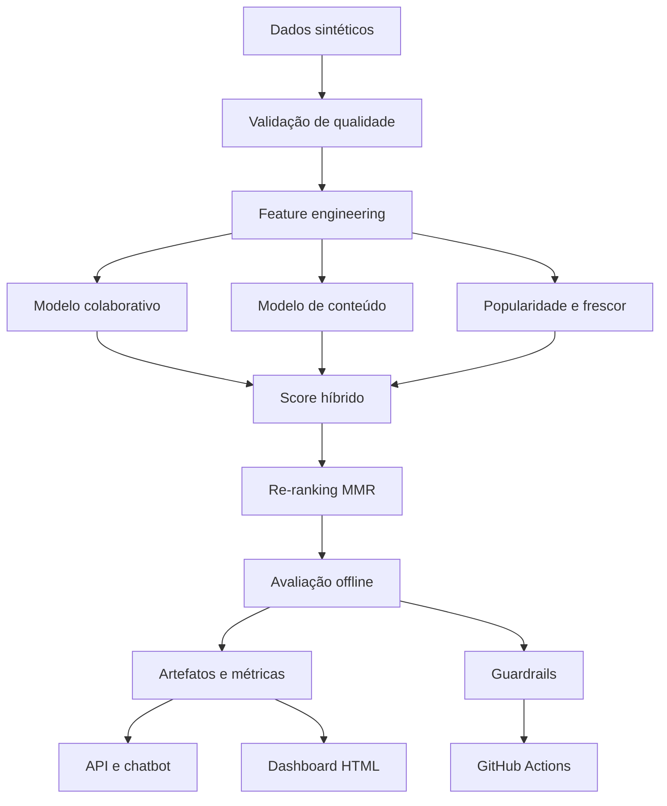

# VibePlay — Recommendation Intelligence

[](https://github.com/WeegorMartins/vibeplay-recommendation-intelligence/actions/workflows/retrain.yml)
[](https://weegormartins.github.io/vibeplay-recommendation-intelligence/)
[](https://www.python.org/)
[](LICENSE)

Sistema híbrido de recomendação desenvolvido para demonstrar, de ponta a ponta, como transformar interações comportamentais em recomendações personalizadas, explicáveis e monitoráveis.

O projeto reúne Ciência de Dados, Machine Learning, Product Analytics, automação de processos, API, chatbot analítico, dashboard em HTML e práticas de MLOps.

> Todos os usuários, títulos e eventos utilizados neste projeto são sintéticos e foram criados exclusivamente para fins educacionais e de portfólio.

## Acesse o projeto

- [Dashboard interativo](https://weegormartins.github.io/vibeplay-recommendation-intelligence/)
- [Executar no Google Colab](https://colab.research.google.com/github/WeegorMartins/vibeplay-recommendation-intelligence/blob/main/notebooks/VibePlay_Case_Colab.ipynb)
- [Guia completo do projeto](docs/GUIA_COMPLETO.md)
- [Apresentação do case](docs/APRESENTACAO_CASE.md)
- [Arquitetura da solução](docs/ARQUITETURA.md)
- [Model Card](docs/MODEL_CARD.md)

---

## Visão geral

O VibePlay simula uma plataforma de streaming que precisa recomendar conteúdos relevantes para diferentes perfis de usuários.

O principal desafio não é apenas prever o próximo clique. Um sistema de recomendação também precisa:

- atender usuários com pouco ou nenhum histórico;
- evitar recomendações excessivamente concentradas;
- equilibrar relevância, diversidade, novidade e popularidade;
- explicar por que cada conteúdo foi recomendado;
- monitorar qualidade e possíveis riscos do modelo;
- transformar métricas técnicas em decisões de produto.

A solução foi construída com um modelo híbrido e uma camada de re-ranking orientada a diversidade.

## Base demonstrativa

| Componente | Volume |
|---|---:|
| Usuários | 800 |
| Títulos | 240 |
| Interações comportamentais | 36.739 |
| Tipos de evento | play, like, complete e skip |
| Natureza dos dados | Sintéticos |

As interações possuem pesos diferentes. Conclusões, curtidas e reproduções representam sinais positivos, enquanto skips ajudam a identificar baixa afinidade.

## Resultados da avaliação offline

A avaliação foi feita com divisão temporal, utilizando eventos anteriores para treinamento e eventos posteriores para teste.

| Métrica | Popularidade | Modelo híbrido |
|---|---:|---:|
| Precision@10 | 3,88% | **7,62%** |
| Recall@10 | 5,27% | **10,21%** |
| NDCG@10 | 4,93% | **10,26%** |
| Cobertura do catálogo | — | **97,08%** |
| Diversidade média de gêneros | — | **82,24%** |
| Novelty | — | **7,945** |

O modelo híbrido praticamente dobrou Precision@10 e Recall@10 em relação ao baseline de popularidade. O ganho em NDCG@10 também mostra que os itens relevantes apareceram em posições melhores no ranking.

A cobertura de 97,08% indica que o motor consegue utilizar quase todo o catálogo, reduzindo a concentração apenas nos títulos mais populares.

> Esses são resultados de avaliação offline sobre dados sintéticos. Eles não comprovam aumento real de retenção, receita ou horas assistidas. A validação de impacto deve ser feita com um teste A/B controlado.

## Como o sistema funciona

### 1. Filtragem colaborativa

Identifica padrões de comportamento compartilhados entre usuários e conteúdos.

Usuários com históricos semelhantes ajudam o sistema a descobrir títulos com maior probabilidade de interesse.

### 2. Similaridade de conteúdo

Utiliza características como gêneros, tipo, ano e descrição do título.

A representação textual é construída com TF-IDF, permitindo recomendar conteúdos semelhantes aos que o usuário já consumiu ou avaliou positivamente.

### 3. Popularidade qualificada

Funciona como sinal complementar e como fallback para usuários sem histórico suficiente.

A popularidade não é utilizada sozinha, evitando que o sistema recomende sempre os mesmos sucessos.

### 4. Frescor

Adiciona um sinal moderado para conteúdos recentes, sem substituir a relevância individual.

### 5. Score híbrido

O ranking combina os quatro componentes:

| Componente | Peso |
|---|---:|
| Filtragem colaborativa | 52% |
| Similaridade de conteúdo | 28% |
| Popularidade | 12% |
| Frescor | 8% |

### 6. Diversidade com MMR

Após a geração dos candidatos, o algoritmo Maximal Marginal Relevance faz o re-ranking.

O objetivo é equilibrar:

- relevância para o usuário;
- variedade entre os itens recomendados;
- menor repetição de gêneros e conteúdos muito parecidos.

### 7. Cold start

Para usuários novos, o sistema combina:

- preferências declaradas durante o onboarding;
- popularidade qualificada;
- frescor;
- diversidade de gêneros.

Quando o usuário acumula interações suficientes, o ranking migra gradualmente para o score híbrido personalizado.

## Arquitetura



## Dashboard

O dashboard foi desenvolvido em HTML, CSS e JavaScript, com gráficos em Plotly.

Ele apresenta quatro áreas principais:

1. **Visão executiva:** usuários, interações, Recall@10, cobertura e comportamento recente.
2. **Qualidade do modelo:** comparação entre o modelo híbrido e o baseline.
3. **Recomendações:** ranking individual com score e explicação de cada item.
4. **Governança:** diversidade, cobertura, feedback, monitoramento regional e guardrails.

O front-end consome o arquivo versionado:

```text
dashboard/assets/dashboard_data.json
```

Isso permite publicar o painel gratuitamente no GitHub Pages sem necessidade de servidor ativo.

## Chatbot analítico

O projeto inclui um chatbot determinístico para responder perguntas sobre os resultados do modelo, como:

- O Recall@10 está bom?
- Como o sistema trata usuários novos?
- Como evitar uma bolha de conteúdo?
- Qual é a cobertura do catálogo?
- Como validar o resultado no negócio?

As respostas são baseadas nos artefatos produzidos pelo pipeline. O chatbot não inventa métricas e sempre informa que os dados são demonstrativos.

## Automação e MLOps

O workflow do GitHub Actions executa automaticamente:

1. instalação das dependências;
2. geração ou leitura dos dados;
3. validação dos contratos de dados;
4. treinamento do recomendador;
5. avaliação offline;
6. execução dos testes;
7. validação dos guardrails;
8. atualização dos artefatos;
9. publicação do dashboard no GitHub Pages.

Uma métrica melhor não autoriza automaticamente a publicação. O pipeline também verifica cobertura, diversidade e qualidade mínima.

## Estratégia proposta para o teste A/B

A avaliação offline indica que o modelo híbrido é um candidato melhor que o baseline, mas a decisão de produto depende de um experimento online.

### Hipótese

Exibir recomendações personalizadas aumenta o consumo relevante sem provocar aumento de skips, latência ou concentração do catálogo.

### Grupos

- **Controle:** ranking baseado em popularidade qualificada.
- **Tratamento:** modelo híbrido com re-ranking MMR.
- **Unidade de randomização:** usuário.
- **Divisão inicial:** 50% controle e 50% tratamento.

### Métrica primária

- horas assistidas por usuário exposto.

### Métricas secundárias

- CTR das recomendações;
- taxa de conclusão;
- retenção;
- títulos distintos consumidos;
- conversão da recomendação em reprodução.

### Guardrails

- taxa de skip;
- latência da recomendação;
- concentração do catálogo;
- diversidade de gêneros;
- reclamações ou feedback negativo.

O modelo somente deverá substituir o controle se apresentar ganho relevante na métrica primária sem deteriorar os guardrails.

## Tecnologias utilizadas

- Python
- pandas
- NumPy
- scikit-learn
- SciPy
- FastAPI
- Uvicorn
- pytest
- HTML5
- CSS3
- JavaScript
- Plotly
- GitHub Actions
- GitHub Pages
- Google Colab

## Como executar

### Google Colab

Abra o notebook principal:

[Executar no Google Colab](https://colab.research.google.com/github/WeegorMartins/vibeplay-recommendation-intelligence/blob/main/notebooks/VibePlay_Case_Colab.ipynb)

### Ambiente local

```bash
git clone https://github.com/WeegorMartins/vibeplay-recommendation-intelligence.git
cd vibeplay-recommendation-intelligence

python -m venv .venv
source .venv/bin/activate

python -m pip install -r requirements.txt
python -m src.pipeline
```

No Windows:

```powershell
.venv\Scripts\activate
python -m pip install -r requirements.txt
python -m src.pipeline
```

### Executar os testes

```bash
python -m pytest -q
python scripts/check_guardrails.py
```

### Executar a API

```bash
python -m uvicorn api.app:app --reload
```

Depois, acesse:

```text
http://127.0.0.1:8000/docs
```

### Visualizar o dashboard localmente

```bash
python -m http.server 8080 --directory dashboard
```

Acesse:

```text
http://localhost:8080
```

## Estrutura do repositório

```text
.
├── api/
│   └── app.py
├── artifacts/
│   ├── metrics.json
│   ├── model.joblib
│   └── sample_recommendations.csv
├── dashboard/
│   ├── assets/dashboard_data.json
│   ├── app.js
│   ├── index.html
│   └── styles.css
├── data/raw/
│   ├── catalog.csv
│   ├── interactions.csv
│   └── users.csv
├── docs/
├── notebooks/
├── scripts/
├── src/
├── tests/
├── Makefile
├── requirements.txt
└── retrain.yml
```

## Documentação

| Documento | Conteúdo |
|---|---|
| [Guia completo](docs/GUIA_COMPLETO.md) | Passo a passo do projeto |
| [Arquitetura](docs/ARQUITETURA.md) | Componentes e fluxo técnico |
| [Dicionário de dados](docs/DICIONARIO_DADOS.md) | Campos, tipos e regras |
| [Model Card](docs/MODEL_CARD.md) | Uso, limitações e riscos |
| [Apresentação do case](docs/APRESENTACAO_CASE.md) | Narrativa executiva |
| [Post para LinkedIn](docs/POST_LINKEDIN.md) | Divulgação do projeto |

## Limitações

- Os dados são sintéticos.
- Os resultados são provenientes de avaliação offline.
- Não existe impacto real comprovado em retenção ou receita.
- O projeto não simula todos os efeitos de posição, exposição e sazonalidade.
- O chatbot é determinístico e limitado ao escopo do case.
- A passagem para produção exigiria teste A/B, observabilidade contínua e revisão de privacidade.

## Principais aprendizados

Este projeto demonstra que um sistema de recomendação não deve ser avaliado por apenas uma métrica.

Relevância, diversidade, cobertura, explicabilidade, comportamento de novos usuários e impacto no negócio precisam ser tratados como partes do mesmo produto de dados.

## Autor

**Weegor Martins**

- [GitHub](https://github.com/WeegorMartins)
- [LinkedIn](COLOQUE-AQUI-O-SEU-LINKEDIN)

Projeto desenvolvido para demonstrar competências em Ciência de Dados, Análise de Dados, Machine Learning, sistemas de recomendação, Product Analytics e MLOps.
