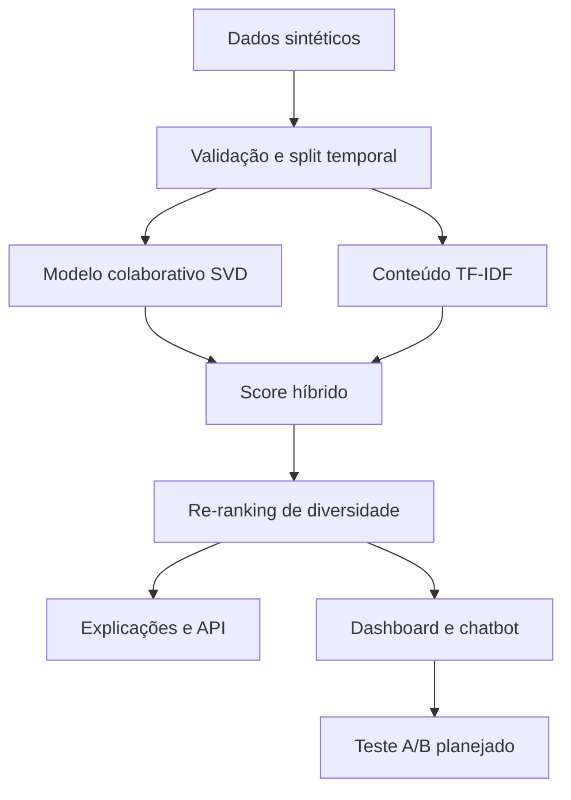

# VibePlay — Recommendation Intelligence

Case completo de portfólio sobre recomendação personalizada, inspirado no tipo de problema encontrado em plataformas de streaming. A solução combina comportamento, conteúdo, popularidade, frescor e diversidade; entrega explicações por recomendação; trata cold start; monitora guardrails; disponibiliza API, chatbot analítico e dashboard HTML.

> Todos os nomes e dados são sintéticos. O projeto não copia algoritmos proprietários de Spotify ou Netflix e não afirma resultado causal sem experimento online.

## O problema de negócio

Uma home baseada apenas em popularidade concentra consumo, esconde catálogo e oferece a mesma experiência para pessoas diferentes. A VibePlay precisa aumentar descoberta e consumo relevante sem criar uma bolha de conteúdo.

**Hipótese:** uma lista híbrida, explicável e diversificada elevará horas assistidas por usuário sem piorar skips, latência ou concentração.

## O que está entregue

- Base sintética reproduzível: usuários, catálogo e eventos.
- Recomendador híbrido: 52% colaborativo, 28% conteúdo, 12% popularidade e 8% frescor.
- Re-ranking MMR para diversidade.
- Estratégia de cold start.
- Avaliação temporal com Precisão@10, Recall@10, NDCG@10, cobertura, diversidade e novidade.
- Comparação com baseline de popularidade.
- Dashboard HTML/CSS/JavaScript responsivo com Plotly.
- Chatbot analítico determinístico, sem chave de API.
- API FastAPI com recomendações, cold start e chat.
- Automação semanal no GitHub Actions, teste e bloqueio por guardrails.
- Roteiro de apresentação e guia clique a clique.

## Arquitetura



## Execução rápida

No Google Colab, abra `notebooks/VibePlay_Case_Colab.ipynb`. Em um terminal online ou local:

```bash
python -m pip install -r requirements.txt
python -m src.generate_data --output data/raw
python -m src.pipeline --data data/raw --artifacts artifacts --dashboard dashboard
python -m pytest -q
python -m http.server 8000 --directory dashboard
```

Acesse `http://localhost:8000`. Para a API:

```bash
uvicorn api.app:app --reload --port 8001
```

Documentação interativa: `http://localhost:8001/docs`.

## Estrutura

```text
vibeplay-recommender/
├── api/app.py                     # endpoints FastAPI
├── artifacts/                     # modelo, métricas e amostra
├── dashboard/                     # produto HTML publicável
├── data/raw/                      # dataset sintético pronto
├── docs/                          # decisões, dados e apresentação
├── notebooks/                     # execução guiada no Colab
├── scripts/check_guardrails.py    # bloqueio de qualidade
├── src/generate_data.py           # criação da base
├── src/recommender.py             # algoritmo híbrido
├── src/pipeline.py                # treino, avaliação e exportação
└── tests/                         # testes automatizados
```

## Como publicar gratuitamente

Use um repositório público no GitHub. Em **Settings → Pages → Build and deployment → Source**, selecione **GitHub Actions**. O workflow já está preparado para validar, retreinar e publicar a pasta `dashboard/`.

O GitHub documenta Pages em repositórios públicos no plano Free e Actions gratuito em runners padrão para repositórios públicos. O Google Colab também oferece execução gratuita, sujeita a limites variáveis de recursos. Consulte os links oficiais no [Guia Completo](docs/GUIA_COMPLETO.md).

## Resposta executiva

O modelo híbrido deve ser escolhido apenas se superar o baseline offline e respeitar cobertura e diversidade. Mesmo assim, ele é um candidato — não uma vitória de negócio. A decisão final depende de um A/B test com horas assistidas como primária e guardrails de skips, latência e concentração.
