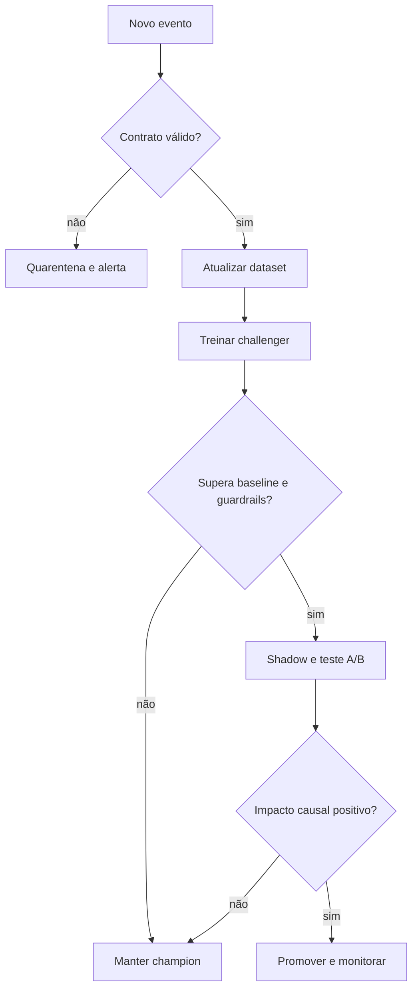

# Arquitetura e decisões técnicas

## Camadas

| Camada | Responsabilidade | Artefato |
|---|---|---|
| Fonte | Usuários, catálogo e eventos sintéticos | `data/raw/*.csv` |
| Preparação | Agregação, pesos e split temporal | `src/pipeline.py` |
| Candidatos | SVD colaborativo e TF-IDF | `src/recommender.py` |
| Ranking | Score híbrido e exclusão de vistos | `src/recommender.py` |
| Re-ranking | Diversidade com MMR | `src/recommender.py` |
| Serving | Recomendações, cold start e chat | `api/app.py` |
| Experiência | Dashboard responsivo | `dashboard/` |
| Operação | Retreino, testes, guardrails e deploy | `.github/workflows/retrain.yml` |

## Fluxo de decisão

## Princípios

1. **Temporalidade:** treino nunca enxerga o futuro.
2. **Baseline explícito:** popularidade é o mínimo competitivo.
3. **Separação de candidatos e ranking:** permite evoluir componentes.
4. **Fallback:** cold start e falha de modelo não deixam a home vazia.
5. **Explicabilidade de produto:** motivo curto e acionável.
6. **Múltiplos objetivos:** relevância não pode destruir variedade.
7. **Promoção segura:** automação valida; não remove governança humana.

